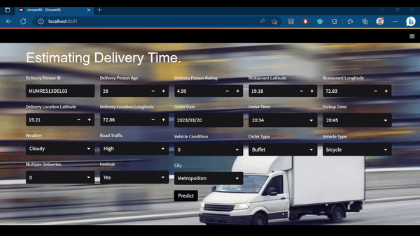
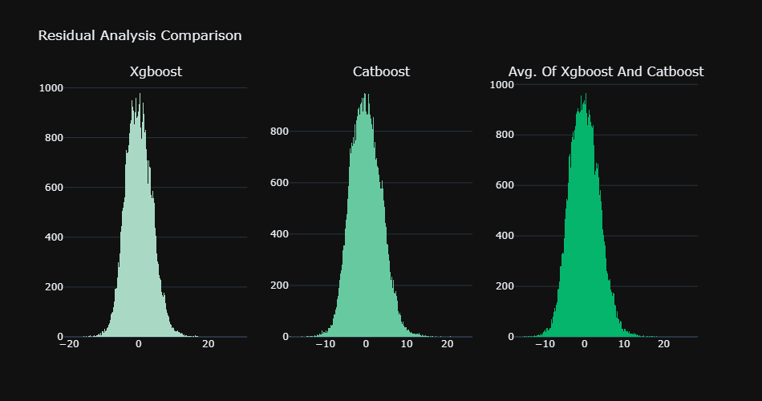

# Estimating Delivery Time
 <br>

## Problem Statement
You are working as a data scientist at a food delivery company. The company wants to imporve its system that calculates ETA for delivery persons. Rather than relying on some fixed method/formula. The management has decided to develop intelligent software that can predict the time of arrival for the delivery persons.

## Task
Develop a machine learning model that can calculate the time taken by delivery person to deliver the order, given relevant information.

## Approach

<details open>
<summary style="font-size: 18px;">E.D.A</summary>

<br>
<p>Time taken to deliver the order is highest in Semi-Urban cities and least in Urban cities¶</p><br>

<br>
<p>To deliver the order on festival is more time consuming. There could be two reasons:<br>
1. Large no. of orders.<br>
2.  More Traffic on roads.<br></p><br>

<br>
<p>Time taken to deliver the order in Fog and Cloudy Weather is greater then in other conditions</p><br>

<br>
<p>It can be observed there is a sudden drop in Time taken from Ratings 4.5 and greater.</p><br>

<br>
<p>Most of the Orders are recieved and delivered during evening(6 PM to 10PM)</p><br>

<br>
<p>Time taken to deliver the order is least in Sunny Weather with Medium Traffic and highest in Foggy Weather in Jam</p><br>

<br>
<p>Time taken to deliver the order is least in Mornings of Cloudy, Fog or Sunny Weather and maximum in evenings.</p><br>

Refer to the [notebook](notebooks/1.%20Data%20Understanding.ipynb) for the complete analysis.
</details>

<details>
<summary style="font-size: 20px;">Feature Engineering</summary>

First, Created Stratified 5 folds of the data. [create_folds.py](src/create_folds.py)

- Filled Null values in Categorical variables by "NULL"
- Fixed ratings and time.

Refer to the [fixing data notebook](notebooks/2.%20fixing%20data.ipynb)

- Extracted granular features from Date and Time columns
- Created bins for Order time.
- Calculated Distance metrics for location data.
- Computed GeoHash of the Locations.
- Greedily combined pairs of categorical columns.

Refer to [feature_eng.py](src/feature_eng.py)

</details>

<details>
<summary style="font-size: 20px;">Feature Encoding</summary>

- Applied Label Encoding on Road_traffic_density, Festival and City columns.
- Applied Target Mean encoding with cross validation on the remaining categorical columns

Refer to [feature_encode.py](src/feature_encode.py)

</details>

<details>
<summary style="font-size: 18px;">Feature Selection</summary>

- Dropped features with variance less than or equal to 0.1.
- Kept the features selected by CatBoost, XGBoost and LightGBM.

Refer to [feature_selection.py](src/feature_selection.py)
</details>

<details>
<summary style="font-size: 18px;">Imputation</summary>

- Iteratively imputed the data using LightGBM and Catboost.
- The Imputed data is only used for the models, which cannot handle null values.

Refer to [impute.py](src/impute.py)

</details>

<details>
<summary style="font-size: 18px;">Model Selection</summary>

Performed Stratified K-fold cross validation on Regression models.
|Model|R2 Score|RMSE|
|----------|------|------|
|LightGBM|0.8274|3.8982|
|CatBoost without categorical encoding|0.8266|3.9077|
|Random Forest|0.8232|3.9461|
|CatBoost with categorical encoding.|0.8188|3.9722|
|XGBoost |0.8167|4.0172|
|Gradient Boosting|0.7836|4.3654|
|AdaBoost|0.6095|5.8631|
|Linear Regression|0.5619|6.2112|

- Based on above results, Selected Model: LightGBM, CatBoost, Random Forest and XGBoost.
- Also, Catboost Performs better with the data in which categorical columns are not encoded.

</details>

<details>
<summary style="font-size: 18px;">Hypertuning</summary>

- Hypertuned the selected models using Optuna.<br>
- Results After Hypertuning:

|Model|R2 Score|RMSE|
|----------|------|------|
|Catboost|0.8319|3.8476|
|XGBoost |0.8318|3.8484|
|LightGBM|0.8284|3.8876|
|Random Forest|0.8274|3.8990|

Refer to [hypertuning.py](src/hypertuning.py)

</details>

<details open>
<summary style="font-size: 18px;">Best Model and Result</summary>

- After Hypertuning, the best models are Catboost and XGBoost.
- Combining(Avg.) their predictions gives slightly better results.

### R2 Score and RMSE
|Model|R2 Score|RMSE|
|----------|------|------|
|Catboost + XGBoost|0.8351|3.811|
|Catboost|0.8319|3.8476|
|XGBoost |0.8318|3.8484|

### Residual Analysis
<br>

### Homoscedastic Test
<br>


</details>

## To train and save the best models
First follow the above approach to prepare the data, then run the following command.

```bash
cd src
sh run.sh  #run
```

## To run the project

```bash
git clone https://github.com/mohan-gupta/driving-scene-segmentation.git  # clone
cd estimationg-delivery-time
pip install -r requirements.txt  # install
cd app
streamlit run streamlit_app.py  #run
```